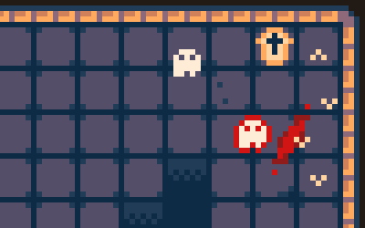

# js13k-2022-moth

> My 2022 entry for the js13kgames competition, Moth.

## PLAY THE GAME!

 - Play the final version submitted to game jam at: https://js13kgames.com/entries/moth
 - The most recent version is available at: https://moth.7tonshark.com

(See changelog before for more information on changes, bug fixes, etc.)

## INSTRUCTIONS

Ambushed, beheaded, burned, and trapped in a wrought iron coffin. Once an almost invincible necromancer, your last remaining toehold in this world is the only nearby creature -- a moth.

Escape your tomb, now full of vengeful ghosts, by possessing an army of restless moths. Gather resources, build defenses, and then strike out for the tomb's exit. Are you ready to reclaim your former glory?

Playable on your phone, tablet, or any desktop browser.

## POSTMORTEM

Check out my postmortem / making-of at https://7tonshark.com/posts/making-of-js13k-2022-moth/

## BUILD

To build the game for yourself:

 1. Clone the repository
 2. `npm install`
 3. `gulp build`

### How does it work?

The gulpfile can get a little long, but in essence what it does is pretty simple:

1. It takes all of the artwork (`.aseprite` files) and uses the Aseprite CLI to collapse all of the frames into one big Spritesheet PNG. This also generates a Spritesheet JSON file listing the pixel coordinates of each frame in the sheet. At the same time, we take just the tiles, and output another PNG that is used as the tileset in Tiled.

2. It runs some custom tools in the `tools/` folder. These tools update generated source files -- first, the "sprite sheet data", which contains those pixel coordinates from the JSON file above, and the entire spritesheet PNG base64-encoded as a string. Second, a source file that represents the "world data" (from Tiled).

3. It takes all of our JavaScript source files and runs Rollup/Terser to generate a single minified JavaScript file.

4. Any CSS and our single JavaScript file are inserted into the `index.html` template -- our output is a single file, `dist/build/index.html`, which is the full playable game.

This is usually where I stop during development. Near the end of the game jam, I'll run `gulp build --dist`, which includes some extra steps:

5. Run Roadroller CLI on the javascript before inserting into the HTML.

6. Zip up the game and run advzip on it.

## CHANGELOG

#### [v1.0.2](https://github.com/elliot-nelson/js13k-2022-moth/releases/tag/v1.0.2) (2022-09-21)

 - Cleaned up loads of old comments and unused files.
 - Generated files now live in `src/js/generated` and `src/assets/generated`.
 - Added a build section describing the build process.

#### [v1.0.1](https://github.com/elliot-nelson/js13k-2022-moth/releases/tag/v1.0.1) (2022-09-14)

 - Bugfix: sound and music do not play in Safari.
 - Resubmitted to game jam.

#### [v1.0.0](https://github.com/elliot-nelson/js13k-2022-moth/releases/tag/v1.0.0) (2022-09-13)

 - Submitted to game jam.
